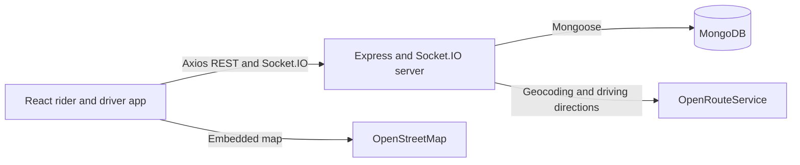

# Uber Clone

A full-stack ride-hailing demo with separate rider and driver experiences. Riders can request rides and follow ride updates; drivers can share their location, receive eligible requests, and progress accepted rides through pickup, OTP verification, and completion.

## Features

- Rider and driver registration, login, profiles, and logout
- Fare estimates for auto, car, and motorcycle based on route distance and duration
- Place suggestions and route estimates through OpenRouteService
- Nearby-driver ride notifications and driver availability/location updates
- Ride acceptance, rejection, cancellation, arrival, OTP verification, start, completion, and history APIs
- Live ride and driver-location updates over Socket.IO
- OpenStreetMap embedded map view

This is a project demo, not a payment-enabled dispatch service. The ride schema has payment-related fields, but no payment integration is implemented.

## Technology

- Frontend: React 18, Vite, React Router, Axios, Socket.IO Client, Tailwind CSS
- Backend: Node.js, Express 4, Socket.IO, Mongoose, MongoDB
- Authentication: bcrypt password hashing and role-bearing JWTs
- Location services: OpenRouteService geocoding/directions and OpenStreetMap map embeds

## Architecture



## Application Flow

1. A rider searches for pickup and destination places, requests a fare estimate, selects a vehicle type, then creates a ride.
2. The backend saves a pending ride and notifies connected, available drivers of the matching vehicle type within 6 km of the pickup coordinates.
3. A driver accepts the request; the rider receives the driver's details and a six-digit OTP.
4. The driver marks arrival, verifies the rider's OTP, starts the ride, and marks it complete. A ride can be cancelled while pending, accepted, or arriving.

The driver browser shares its geolocation while connected to the driver home view. Rider pickup and destination are selected from place suggestions; rider GPS acquisition is not implemented.

## Repository Layout

```text
Backend/     Express API, Socket.IO handlers, Mongoose models, and tests
Frontend/    React/Vite application
README.md    Project overview and local setup
```

- [Frontend documentation](Frontend/README.md)
- [Backend documentation](Backend/README.md)

## Prerequisites

- Node.js 18 or newer and npm
- A MongoDB connection string
- An OpenRouteService API key for place lookup, distance, duration, and fare calculations

## Run Locally

Install and configure the backend:

```powershell
cd Backend
npm install
Copy-Item .env.example .env
```

Set `MONGO_URI`, `JWT_SECRET`, and `ORS_MAPS_API` in `Backend/.env`. Then run the API in one terminal:

```powershell
npm run dev
```

In a second terminal, install and start the frontend:

```powershell
cd Frontend
npm install
Copy-Item .env.example .env
npm run dev
```

The frontend is served by Vite at `http://localhost:5173` by default. The backend listens at `http://localhost:4000` by default. The API root (`/`) reports service status; `/health` reports whether MongoDB is connected.

## Environment Variables

| Application | Variable | Required | Purpose |
| --- | --- | --- | --- |
| Backend | `MONGO_URI` | Yes for database-backed requests | MongoDB connection string |
| Backend | `JWT_SECRET` | Yes | Signs and verifies authentication tokens |
| Backend | `ORS_MAPS_API` | Yes for maps, distance, and fare features | OpenRouteService API key |
| Backend | `PORT` | No | HTTP port; defaults to `4000` |
| Backend | `CLIENT_ORIGIN` | No | Comma-separated allowed browser origins; defaults to `http://localhost:5173` |
| Backend | `NODE_ENV` | No | Controls auth-cookie `secure` and `sameSite` settings when set to `production` |
| Frontend | `VITE_BASEAPP_BACKEND_URL` | No | Backend origin; defaults to `http://localhost:4000` |

See each application's `.env.example` for the local template. Do not commit actual credentials.

## API and Real-Time Overview

The API is rooted at `/api`: `/users` and `/drivers` handle accounts, `/maps` provides authenticated place and route lookups, and `/rides` handles fares and ride lifecycle operations. The frontend uses bearer JWTs for its Axios requests. Socket.IO authenticates a connection with a JWT and role during the `join` event; ride requests, ride status changes, and driver location updates are then sent to connected clients. The full endpoint list and event payload notes are in the [backend guide](Backend/README.md).

## Screenshots
### 1. User Sign-In Page

<p align="center">
  
</p>

### 2. Pickup and Drop Destination Selection

<p align="center">
  
</p>

### 3. Fare Calculation

<p align="center">
  
</p>

### 4. Ride Creation

<p align="center">
  
</p>

### 5. Driver Searching for Rides

<p align="center">
  
</p>
